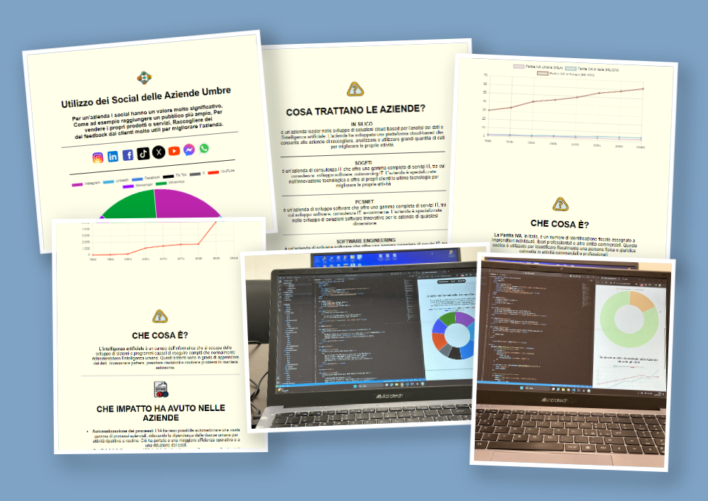

# 🏢 Sito Web – Aziende Informatiche in Umbria

## 🎯 Obiettivo del Progetto

Ho realizzato questo sito web utilizzando **HTML** e **CSS**, applicando le competenze acquisite nel corso degli anni scolastici nel campo della progettazione di pagine web.

🧠 Il sito è stato progettato per:

- Visualizzare **statistiche** sulle aziende informatiche presenti in Umbria
- Implementare **grafici a torta 📊** con il supporto di ChatGPT
- Recuperare **dati e informazioni** tramite ricerche su Google

📁 Il sito include diverse sezioni, tra cui:

- 🔟 **Top 10 aziende informatiche** in Umbria  
- 📈 **Distribuzione delle partite IVA** in Umbria, Italia ed Europa  
- 🤖 **Evoluzione dell’uso dell’intelligenza artificiale** nel tempo, tramite grafico  

🖥️ Il sito è stato **hostato gratuitamente** su **Tiiny.Host**, una piattaforma semplice che consente di caricare un progetto web statico online.

---

## 🔍 Preview del Sito

🌐 **[Clicca qui per vedere il sito online](https://aziendeumbre.tiiny.site/index.html)**
